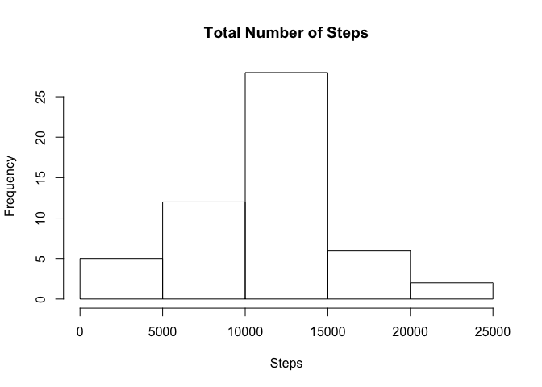
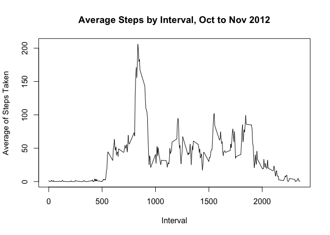

## Loading and preprocessing the data

```r
unzip(zipfile = "./activity.zip")
fb<-read.csv("./activity.csv")
```


## What is mean total number of steps taken per day?

```r
cb<-aggregate(steps~date,fb,sum)
mx<-mean(cb$steps)
md<-median(cb$steps)
hist(cb$steps, 
       main="Total Number of Steps", 
       xlab="Steps"
     )
```

<!-- -->

The mean of total steps per day is 10766.19.  
The median of same is 10765.


## What is the average daily activity pattern?

```r
zb<-aggregate(steps~interval,fb,mean)

plot(zb$interval,zb$steps,
     type = "l", 
     main="Average Steps by Interval, Oct to Nov 2012",
     ylab = "Average of Steps Taken", 
     xlab = "Interval")
```

<!-- -->

```r
zb[which.max(zb$steps),]
```

```
##     interval steps
## 104      835   206
```


## Imputing missing values
There are a total of 2304 missing values in the dataset. To impute values to those rows, we will follow a plan of find-match-replace:  
1. Find a row that needs to be imputed;  
2. Match the interval of that row to the interval in a data frame with average steps by interval;  
3. Replace the missing value with the average value for that interval  


## Are there differences in activity patterns between weekdays and weekends?
